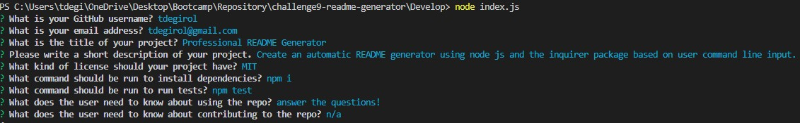

# test

  ## Licensing:
  (https://opensource.org/licenses/MIT)

  ## Table of Contents
    - [Description](#description)
    - [Installation](#install)
    - [Usage](#usage)
    - [Contributing](#contributions)
    - [Testing](#tests)
    - [Questions](#questions)

  
  ## Description
  test

  
  ## Installation 
  test

  
  ## Usage 
  test
  

  
  ## Contributing
  test

  
  ## Testing
  test

  
  ## Questions 
  - Github: [test](https://github.com/test)
  - Email: test
